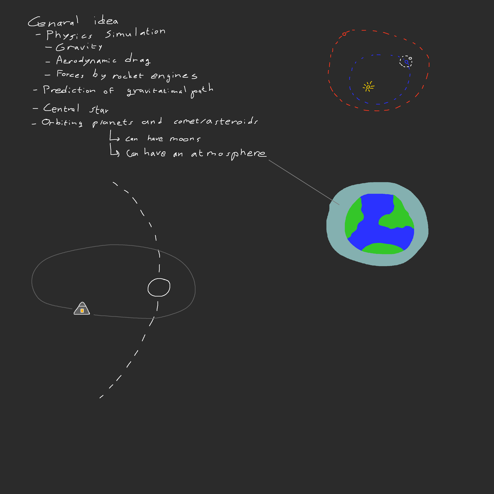

# KSP 2D Project

## Overview
This project is going to be somewhat like Kerbal Space Program, but in 2D. It will be exclusively single player. The current flowchart can be found in the doc/ folder.

The image below is the initial sketch of the project.

## Requirements and rough planning
### Requirements
    - State based system for switching between different functionalities.
        - Menu state.
        - Loading solar system state.
        - Generating solar system state.
        - Solar system view state.
        - Vehicle assembly state.
        - Saving solar system state.
    - Load/generate solar system and generate precalculated orbits.
    - Load player vessels, player achievements, and player statistics.
    - Update vessel positions and velocities based on position relative to celestial bodies.
    - Update player statistics and detect achievements.
    - Handle player input and apply forces/torques on the currently controlled vessel.
    - Render the solar system.

### Deadlines
18-11-2022: State system.

- [ ] Implement state system and the menu state.
    - Added/completed: 18-11-2022/tbd

19-11-2022: Solar system with predetermined orbits of planets and moons.

- [ ] Set up json format for a body with an orbit around the sun/around a planet.
    - Added/completed: 18-11-2022/tbd
- [ ] Implement precalculating orbit positions over time on first load.
    - Added/completed: 18-11-2022/tbd
- [ ] Generate a file with orbit statistics after precalculating orbits.
    - Added/completed: 18-11-2022/tbd
- [ ] Implement time variable.
    - Added/completed: 18-11-2022/tbd
- [ ] Implement rendering of the solar system.
    - Added/completed: 18-11-2022/tbd

20-11-2022: Serialization and deserialization.

- [ ] Implement serialization of time variable and deserialization on load.
    - Edge case: file does not exist -> create new time variable and serialize on exit.
    - Added/completed: 18-11-2022/tbd